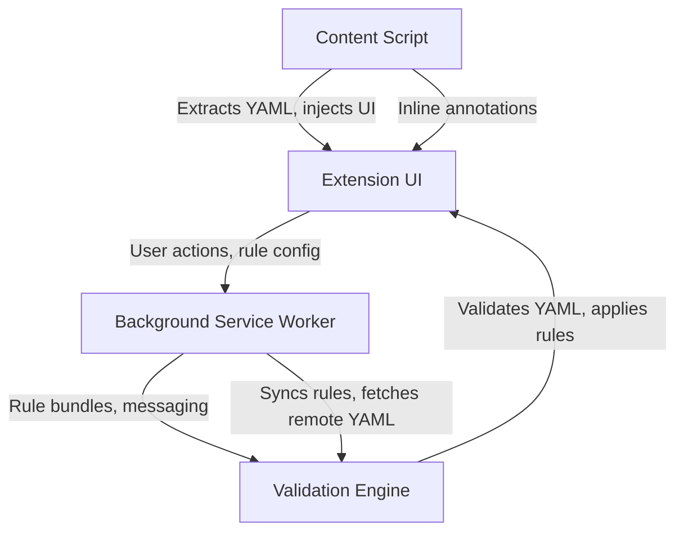

# 🛡️ Guardon — Catch Kubernetes Security Issues Before They Hit Production

[](https://chrome.google.com/webstore)
[](https://github.com/guardon-dev/guardon/actions)
[](LICENSE)

> **Spot Kubernetes security misconfigurations instantly while reviewing code on GitHub/GitLab. No CI setup required.**


## 🚀 Quick Start (30 seconds)

1. **[Install from Chrome Web Store →](https://chrome.google.com/webstore)**
2. **Open any Kubernetes YAML on GitHub/GitLab**
3. **Click the Guardon icon** — violations appear instantly with suggested fixes

📺 **[2-minute demo video →](https://youtu.be/b-kzvAfV5r8)**

## ✨ Why Developers Love Guardon

- **🔍 Instant feedback** — No waiting for CI pipelines or security scans
- **🎯 Context-aware** — Works directly in your GitHub/GitLab workflow  
- **⚡ Zero setup** — Browser extension, no infrastructure changes
- **🛠️ Actionable fixes** — Copy-paste ready YAML patches
- **🔧 Fully customizable** — Import your own rules or Kyverno policies

## 🎯 Common Issues Guardon Catches


```yaml
# ❌ Privileged containers
securityContext:
  privileged: true  # Guardon flags this

# ❌ Missing resource limits
containers:
  - name: app
    image: nginx
    # Guardon suggests adding:
    resources:
      limits:
        cpu: "500m"
        memory: "256Mi"

# ❌ Latest tags in production
containers:
  - name: app
    image: nginx:latest  # Guardon suggests using a versioned tag

# ❌ Running as root user
securityContext:
  runAsUser: 0  # Guardon flags this and suggests a non-zero value

# ❌ Missing CPU requests
resources:
  requests:
    cpu: null  # Guardon suggests specifying a value like "100m"
```

Guardon checks for:
- Use of `latest` image tags
- Missing resource limits and requests
- Privileged containers
- Containers running as root
- Pod security context not enforcing non-root
- Other security and configuration best practices

**💡 Pro tip:** Guardon shows you exactly what to fix and provides copy-paste ready solutions.

## 4. System Architecture

Guardon consists of four core modules:

1. **Content Script**
  - Injected into GitHub/GitLab pages
  - Extracts Kubernetes YAML from PRs, files, and diffs
  - Displays inline annotations and highlights violations

2. **Validation Engine**
  - Parses YAML and applies schema checks using js-yaml
  - Evaluates rules from JSON and imported Kyverno policies
  - Generates actionable fix suggestions for detected issues

3. **Background Service Worker**
  - Manages cross-tab communication and extension lifecycle
  - Handles background tasks like rule bundle management and remote fetches
  - Coordinates storage and sync of custom rules

4. **Extension UI**
  - Popup interface for instant YAML validation and fix previews
  - Options page for rule import, export, and customization
  - Integrated rule editor for creating and managing custom bundles

### System Architecture Diagram



*If Mermaid diagrams are not supported, see the ASCII version below:*

```
  [Content Script]
      |
      v
  [Extension UI] <--> [Background Service Worker] <--> [Validation Engine]
      ^                                         |
      |-----------------------------------------|
```

## 👥 Who Uses Guardon

- **Platform Engineers** — Catch misconfigurations during code review
- **Security Teams** — Enforce governance policies without blocking developers  
- **DevOps Engineers** — Prevent production incidents from bad YAML
- **Kubernetes Newcomers** — Learn security best practices as you code

> *"Guardon caught a privileged container in our deployment that would have been a security incident. Saved us hours of debugging!"* — Platform Engineering Team


## 🛡️ Key Features of Guardon

- **Instant Kubernetes YAML validation** — Flags security misconfigurations as you browse GitHub/GitLab, no CI/CD required.
- **Schema-aware checks** — Validates against uploaded Kubernetes OpenAPI/CRD schemas for required fields and type safety.
- **Customizable rule engine** — Supports JSON-based rules and Kyverno policy import for organization-specific standards.
- **Multi-document YAML support** — Handles complex manifests with multiple resources in one file.
- **Actionable fix suggestions** — Provides copy-paste ready YAML patches for every violation.
- **Dark mode UI** — Seamless experience for day and night workflows.
- **Offline-first** — All validation runs locally in your browser; no network calls.
- **Manual paste & validation** — Validate YAML even outside GitHub/GitLab by pasting directly in the popup.
- **Enterprise-ready** — Import and manage custom rules, preview Kyverno policies, and enforce governance at scale.

## 🔧 Development Setup (2 minutes)

**For Contributors & Custom Rules:**

```bash
# 1. Clone and setup
git clone https://github.com/guardon-dev/guardon.git
cd guardon
npm install

# 2. Load into Chrome
# Open chrome://extensions → Enable Developer mode → Load unpacked (select this folder)

# 3. Test your changes
npm test
```

**Requirements:** Node.js 16+ (for tests), any Chromium-based browser

## 💡 How It Works

**Simple workflow:**
1. **Browse** Kubernetes YAML on GitHub/GitLab
2. **Click** the Guardon extension icon  
3. **Review** security issues with explanations
4. **Copy** suggested fixes and apply them

**Advanced usage:**
- **Paste YAML directly** for ad-hoc validation
- **Import Kyverno policies** from your governance tooling
- **Create custom rules** for your organization's standards  
- **Batch validate** multiple YAML documents

### Popup Actions
- 🔧 **Preview patch** — See exactly what the fix looks like
- 📋 **Copy snippet** — Grab just the fixed value 
- ℹ️ **Explain** — Understand why this matters (with CIS/NIST references)

---

## 📚 Technical Documentation

<details>
<summary><strong>🔧 Custom Rules & Configuration</strong></summary>

### Rule Schema

- Rules are stored in extension storage and editable via the Options page (`src/options/options.html`).
- Rule schema (important fields):

  - `id`: unique rule identifier
  - `description`: human description
  - `kind`: optional comma-separated kinds to scope the rule
  - `match`: dot/array path to inspect (supports `[*]` for arrays)
  - `pattern`: a JavaScript RegExp string to evaluate against the target value
  - `required`: boolean — mark field as required
  - `severity`: `info` | `warning` | `error`
  - `fix`: optional JSON describing a suggested fix (action/value/hint)
  - `explain`: optional object { rationale: string, refs: string[] }

### Options Page Features
- Add/Edit/Delete rules
- Import from file or URL (background fetch fallback)
- Kyverno policy detection + preview of converted rules
- Import panel buttons: "Paste from clipboard" and "Cancel" (convenience and clear/close the import UI)
- Quick "Suggest resource fix" helper to populate the Fix JSON textarea with a sensible requests/limits suggestion for resource-related rules

</details>

<details>
<summary><strong>📦 Kyverno Policy Import</strong></summary>

- Located at `src/utils/kyvernoImporter.js`.
- Detects Kyverno Policy manifests (apiVersion contains `kyverno.io` and kind Policy/ClusterPolicy).
- Converts simple `validate.pattern` leaves into required checks and pattern-based rules. Also detects common env `name`/`value` entries and converts negative checks (`!value`) into pattern rules with sibling conditions.
- Converted rules are previewed in the Options page; you can import converted rules or store raw Kyverno policies for audit.

**Limitations:** the importer is heuristic and intentionally conservative — complex policies are not fully converted and are left for manual review.

</details>

<details>
<summary><strong>🏗️ Architecture Overview</strong></summary>


**High-level architecture:**
- **Popup UI:** user-triggered validation, YAML paste, and results/suggestions UI.
- **Content script:** message-driven page extractor that returns raw YAML when requested by the popup.
- **Background (service worker):** performs fallback fetches (raw content, import-from-URL), accesses storage.
- **Rules engine & utilities:** multi-doc YAML parsing, rule evaluation (kind filtering, wildcard per-element checks), suggestion generation and preview helpers, and Kyverno importer.

This diagram shows the main data flow: the popup requests YAML from the content script (or falls back to background fetch), sends YAML to the rules engine for validation, and displays violations and optional fix suggestions to the user.

</details>

<details>
<summary><strong>🧪 Development & Testing</strong></summary>

**Run unit tests and collect coverage:**

```bash
npm install
npm test
```

- Tests use Jest and target utility modules under `src/utils`. Coverage reports are stored in `coverage/`.

</details>

<details>
<summary><strong>📦 Building Distribution</strong></summary>

We provide small scripts that create a trimmed ZIP containing only the runtime files needed by the extension (manifest, popup/options, background, content script, runtime libs). Use these to produce the ZIP you upload to the Chrome Web Store.

**PowerShell (Windows):**
```powershell
.\scripts\build-dist.ps1
# or specify a custom filename
.\scripts\build-dist.ps1 -OutFile guardon-latest.zip
```

**Bash (Linux/macOS/WSL):**
```bash
chmod +x ./scripts/build-dist.sh
./scripts/build-dist.sh
# or with explicit output name
./scripts/build-dist.sh guardon-latest.zip
```

</details>

## 🔧 Troubleshooting

| Issue | Solution |
|-------|----------|
| "Validation engine not available" | Open DevTools for popup and check console for import errors |
| Suggestions not appearing | Verify rules in Options page include `fix` and `explain` metadata |
| `npm install` fails | Check Node version (`node -v`) and share npm error logs for help |

---

## 📖 Additional Resources

- **[Governance & Maintainers](GOVERNANCE.md)** — Project governance and decision-making process
- **[Contributing Guidelines](CONTRIBUTING.md)** — Detailed contribution instructions and DCO process  
- **[Roadmap](ROADMAP.md)** — Planned features, milestones, and time horizons
- **[Security Policy](SECURITY.md)** — Responsible disclosure and security practices

## 📄 License

**Apache-2.0** — See the [LICENSE](LICENSE) file for details.

---

<div align="center">

**Made with ❤️ for the Kubernetes community**

[⭐ Star this project](https://github.com/guardon-dev/guardon) • [🐛 Report a bug](https://github.com/guardon-dev/guardon/issues) • [💡 Request a feature](https://github.com/guardon-dev/guardon/discussions)

</div>
